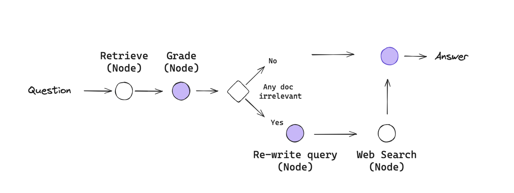

## SUMMARY
blah, blah, blah.


---

## CONFIGURATION : CLONE REPO
```bash
git clone https://github.com/johntday/llm_crag_llamaindex.git
cd llm_crag_llamaindex
```

## CONFIGURATION : PROJECT DEPENDENCIES
Install the project dependencies to `.../llm_crag_llamaindex/.venv/`
```bash
rm -rf .venv/ 
python -m venv .venv 
source .venv/bin/activate 
pip install -r requirements.txt
```

## RUN
Start the `streamlit` app.  This will open a browser to `http://localhost:8501`.
```bash
streamlit run app.py
```

## REFERENCES
xxx

## APP GUIDE

You can access it at http://localhost:8501 in your web browser. Here's what you can do with the app:
- First, you'll need to get a Linkup API key from https://app.linkup.so/sign-up
- Enter your Linkup API key in the sidebar.  This is used for web search.
- Upload a PDF document that you want to chat about
- Once the document is processed, you can ask questions about it in the chat interface

The app uses:
- Streamlit for the web interface
- LlamaIndex for document processing and RAG
- Qdrant for vector storage
- Ollama (deepseek-r1:7b model) for text generation
- Linkup for deep web search capabilities
